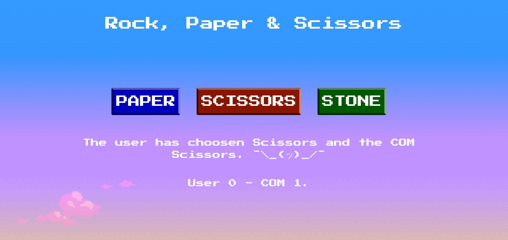

# Rock, Paper & Scissors

A RPS Game based on JavaScript to improve my abilities. :)

## Getting Started

These instructions will get you a copy of the project up and running on your local machine for development and testing purposes. See deployment for notes on how to deploy the project on a live system.

### Prerequisites

It works directly on the browser

### Installing

Download the project and open it on the Browser (or try it live : [Demo Link]([https://link](https://subirats345.github.io/Stone--Paper---Scissors---A-JS-Game/)))

## Built With

* JS
* jQuery
* Bootstrap
* HTML
* CSS

## Authors

* **Joan Subirats** - *Initial work* - [subirats345](https://github.com/subirats345)

## License

This project is licensed under the MIT License - see the [LICENSE.md](LICENSE.md) file for details

[Live Demo - https://subirats345.github.io/Stone--Paper---Scissors---A-JS-Game/](https://subirats345.github.io/Stone--Paper---Scissors---A-JS-Game/)
